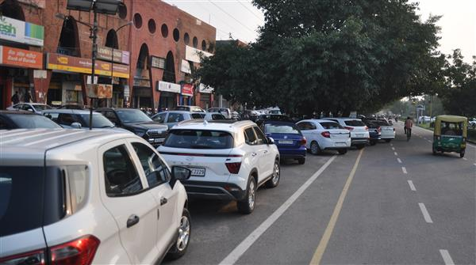

# Problem Description
In developing nations like India, parking is one of the biggest challenges in Urban areas. You will find illegally parked vehicles all over the cities, which narrows the roads thus traffic congestion increases.

In the following image, one can easily identify which cars are parked illegally. The illegally parked Cars have created a bottleneck to the smooth traffic.

    

				Pic Credit: tribuneindia.com

The illegal parking is not just limited to 4 wheelers- 2 wheelers, trucks, lorries, tractors and all kinds of vehicles are found illegally parked.

Traffic police and Nagar Palika are trying to figure out a viable solution for this problem.
Some of the existing solutions are there but they require a lot of effort from the government body.

# Possible solutions
1. Nagar palika or traffic police take pictures of each illegally parked vehicle and send notice to the respective owner.
1. Nagar Palika tows the vehicles to a nearby booth.
1. Government provides proper parking spots for vehicles, either by having some dedicated multistory buildings, open ground, parking spots on roads etc.
1. Automate the process of lodging complaints against illegal parking.

# Final Solution
1. We are interested in the 4th solution. The goal of this solution is to:
1. Minimize the burden of government officials.
1. Make traffic smooth.
1. Lawbreakers pay the penalty or challan.
1. The overall economy of vehicles increases because of smooth traffic.
1. Government will accumulate the penalty/challan money to invest in improving roads and parking spots/areas.

# System Design

## Functional Requirements
1. System should allow a government official to register de-resister Illegal Parking reporter(IPR) into the system.
1. A registered user should be able to login.
1. System should allow a registered user to open the camera and from the webpage and take photos and make videos of illegally parked vehicles.
1. The photos are videos then sent to the central server for processing.
1. If the proof(photos and videos) are enough to ensure that a vehicle was parked incorrectly then send a notice to the vehicle owner and ask them to visit a nearby traffic police office with a grievance or else the challan will be generated within 15 days.
1. System should allow vehicle owners to pay the dues on the inbuilt payment gateway.
1. The money is linked directly to the local Nagar Palika.
1. System should allow vehicle owners to enable a special status (Parking at allegal location due to urgency) in the system.
1. If someone is parking a vehicle at an illegal spot then  they should pay a fine per hour to avoid getting a challan.
1. IPR should not be able to report a vehicle with special status turned on.

Non-Functional Requirements
1. The reporting should be consistent and error free.
1. The data related to the report should be persistent.
1. Create a list of spots, roads, parks, grounds etc where parking slots are created.
1. Government/Private firms should create parking slots.
1. Parking Slots should be uploaded and available in the system and identifiable by their number.
1. The publicly available parking slots should be free of cost.
1. Make provision to send hard copy notices to individual owners.

# API Design
## Public APIs:
Success_data register_user(api_token, auth_token, user_details)
Success_Data login_user(api_token, auth_token, user_login_details)
Data_Uploaded upload_report(api_token, auth_token, captured_data, confidence)

Private APIs:
Vefifiable_Data fetch_data_for_verification(auth_token, Range_Criteria)

